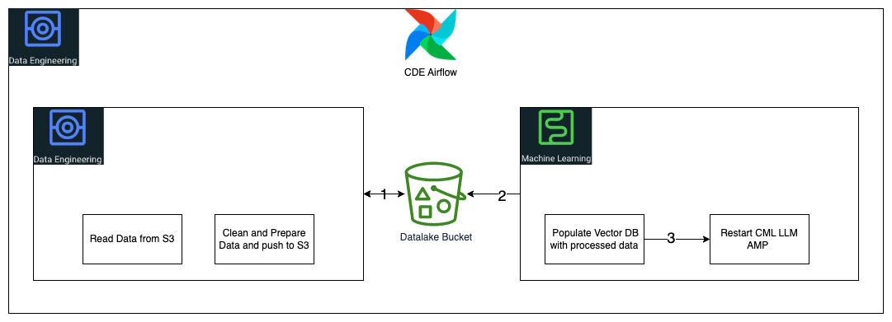

# CDE MBO H1 2024 Project
Git repository for Professional Services quarterly MBO Project. This project is built on top of CDP CDE Data Service.

## Introduction

### Use Case 1 on Generative AI as follows 
Prereqs
- Raw News Article Data stored in S3
- Running CML LLM AMP 

Using CDE Airflow Datapipeline we will

Raw data(News Articles) will be read from S3 (CDE Job) -> Article Content will be processed and final output written to S3(CDE JOB WIP) ->  Vector DB job will be run to populate DB (CML) -> CML LLM Application will be restarted (CML)
This will highlight CDE and CML's ability to process customer data and use it to train an LLM Chatbot all on Customers "own" infrastructure 

Plan for Coming Week 6/26
- Fine tune and Clean Code
- Document and Commit code to Github Repo
- Begin Work on Use Case 2 Open Lakehouse with Stocks Data